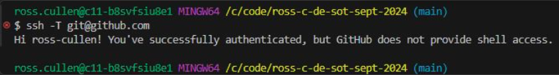
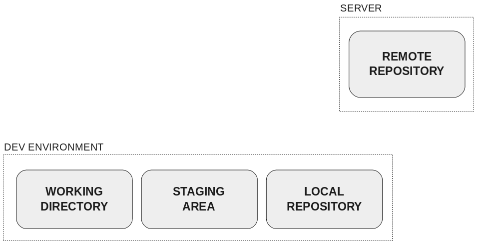
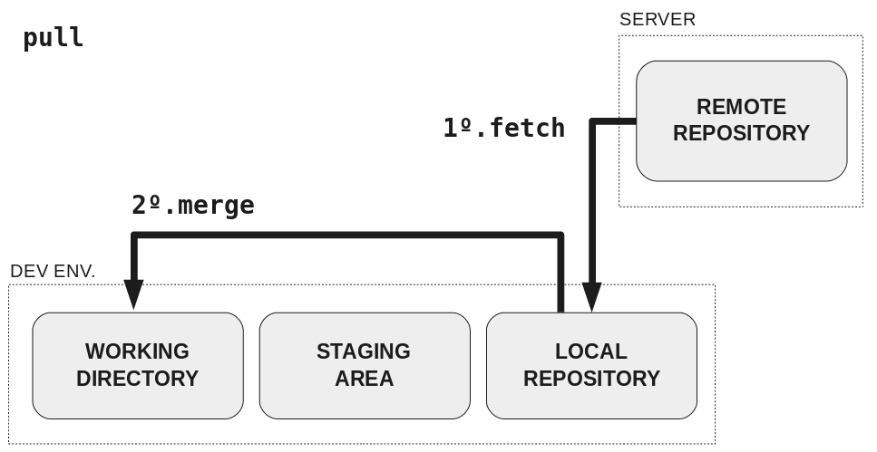
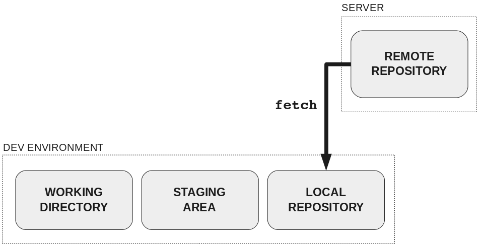

<!-- markdownlint-disable blanks-around-headings -->
## Source Control
## with Git
<!-- markdownlint-disable blanks-around-headings -->

Notes:
Ensure you have completed the prep steps in the instructor README before this session -> [README.md](./README.md)

All the git kata sessions use the source-control-git folder too.

---

## Overview

- Source Control
- Git
- Sharing Code with git
- Branching
- Pull Requests

Notes:
N/A

---

## Learning Objectives

- Describe what source control is, and why we use it
- Add and commit features, and push to remote
- Create branches
- Create, review, and merge pull requests
- Create a Git repository

Notes:
N/A

---

### A World Without Version Control


- If we wanted to keep historical versions of a file, we would need to manually create a file for each version with a new name.
- Keeping track of this would become cumbersome.

Notes:
N/A

---

### What is Source Control?

- Source control allows you to keep track of your files and every change made to them, ever.
- It also allows you to share these files and their change history with others, so they can make changes too.

Notes:
N/A

---

### Git

- A distributed source control management system (SCM)
- It has become the most widely used tool to manage source code nowadays

Notes:
Why is it called git?

The name "git" was given by the creator Linus Torvalds when he wrote the very first version. He described the tool as "the stupid content tracker"

---

### Exercise (part 1/2)

Check you already have it installed:

```sh
$ git --version
git version 2.24.3 (Apple Git-128)
```

Install Git using your package manager if you haven't:

```sh
$ sudo apt-get install git   # Unix
$ brew install git           # macOS - you need Homebrew first
```

Windows: browse to <https://gitforwindows.org/>

Notes:
Windows users will need to open git bash when they've downloaded.

Mac user might not have homebrew installed, so make sure they have that.

---

### Exercise (part 2/2)

Configure Git on your machine. Run each of these one line at a time. Use your own name and email:

```sh
git config --global user.name "Alice Bloggs"
git config --global user.email "alice.bloggs@someserver.com"
git config --global init.defaultBranch main
git config --global core.pager cat
git config --global core.editor "nano"
git config --global pull.rebase false
git config --global fetch.prune true
```

(Windows users should do this in Powershell and all again in GitBash.)

Notes:
"init.defaultBranch main" is for when people make new repos on the command line - recent versions still default to "master"!!!

"core.pager cat" is to force git to print branch names properly (not in a temporary output).

"core.editor nano" saves anyone from having to use VIM!

"pull.rebase false" sets the default merge strategy when pulling.

"fetch.prune true" sets the default to include the "--prune" flag.

---

### Checking we can reach GitHub on port 22

In a Bash or GitBash window run this:

```sh
ssh -T git@github.com
```

You should see something like this, which indicates success:



If you don't, you may ned to check your home router or the office WiFi.

Notes:
Some home internet providers block port 22 (SSH) as it is not commonly used.

---

### Key Git components



_Fear not, this diagram will be explained on the next slide._

Notes:
Fear not, this diagram will be explained on the next slide.

---

### Key Git components

- **Working directory**: your private workspace, where changes are made. It may contain tracked and untracked files.
- **Staging area**: all changes you want to bundle up in the next commit (transaction) to your local repository.
- **Local repository**: your local version of the Git repository.

Notes:
N/A

---

### Making changes in Git

<!-- .element: class="centered" -->

Notes:
N/A

---
### Making changes in Git

- You can think of the steps you take to send your local changes to the remote repository as a bit like what you do when you send a letter:
- First, you take your letter (i.e. your local changes) and put it in an envelope. This like `staging` your local changes.
- Then you double check that the letter is really ready to be sent, and once you're satisfied, you seal the envelope, add the address, and put on a stamp. This is like `committing` your staged changes to your local repository.
- Once all of this is done, and you're really satisfied and ready to share your letter, you can take it to the postbox and send it. This is like `pushing` your committed changes from your local repository to the remote.

Notes:
N/A

---

### Making changes in Git

<!-- .element: class="centered" -->

Notes:
N/A

---

### git add

Mark files in your working directory as tracked so Git starts keeping a track record of all changes to them.

If a file is already tracked and has some changes, move it to the staging area to include it in the next commit.

```sh
# Stage one file
git add myfile.py
# Stage everything in the current directory (and subdirectories)
git add .
```

Notes:
N/A

---

### git commit

Bundle up all staged changes (or new files) in a new commit to apply to the local repository.

```sh
# Write commit message in text editor
git commit
# Or inline commit message
git commit -m "Update function definition"
```

Notes:
N/A

---

### git push

Upload any changes made in your local repository to the remote repository:

```sh
git push
```

Notes:
N/A

---

### git add, commit and push

Let's revisit that sequence:


Notes:
Go back over it and tie it into the Letter analogy

---

### Emoji Check:

Do you feel you understand the git sequence? Say so if not!

1. 😢 Haven't a clue, please help!
2. 🙁 I'm starting to get it but need to go over some of it please
3. 😐 Ok. With a bit of help and practice, yes
4. 🙂 Yes, with team collaboration could try it
5. 😀 Yes, enough to start working on it collaboratively

Notes:
The phrasing is such that all answers invite collaborative effort, none require solo knowledge.

The 1-5 are looking at (a) understanding of content and (b) readiness to practice the thing being covered, so:

1. 😢 Haven't a clue what's being discussed, so I certainly can't start practising it (play MC Hammer song)
2. 🙁 I'm starting to get it but need more clarity before I'm ready to begin practising it with others
3. 😐 I understand enough to begin practising it with others in a really basic way
4. 🙂 I understand a majority of what's being discussed, and I feel ready to practice this with others and begin to deepen the practice
5. 😀 I understand all (or at the majority) of what's being discussed, and I feel ready to practice this in depth with others and explore more advanced areas of the content

---

### When should I commit?

Commits should:

- Pass all tests, and not have any known bugs to be fixed in a future commit
- Small self-contained changes that work
- Have short and meaningful commit messages
- Act as a save point for your code changes

Example commit message: _change function to return integer value rather than string value_

Notes:
The save point is like a point in time you can return to and do things differently, developers use commits to the same effect to undo changes at a sensible point.

---

### One important message about commits

**NEVER** commit sensitive information! This includes:

- Passwords
- Keys
- Private information about a person or entity

As professional software engineers, we can use handy tools like [git-secrets](https://github.com/awslabs/git-secrets) to catch when we might accidentally commit sensitive information.

Check out the [academy-git-secrets-example](https://github.com/infinityworks/academy-git-secrets-example) repo for a demonstration of how this tool can be used in your projects.

Notes:
N/A

---

### When should I push?

> _"Frequently"_

- Code that isn't pushed exists only on your machine. So while it is a "save point" per commit, it's not backed up, and your team can't see it or use it. And if your machine crashes, it's still lost!
- Some teams like to to push with every commit.
- At least - do it when you leave your machine, like lunchtime and at the end of the day.

Notes:
N/A

---

### .gitignore

- We can use a special file called a `.gitignore` to tell git not to track certain files
- This is a good way to protect sensitive information
- It can also come in handy for lots of other things, e.g. local config files, or very large package-related directories

Notes:
N/A

---

### Demo: .gitignore

> The instructor can show you how this works

Notes:
Demonstrate adding a file you don't want like "logs.txt", then ignore it, then add/commit/push the ignore file

---

### Quiz Time! 🤓

---

**Which git command would you use to apply your locally staged changes to your local repository?**

1. `git status`
1. `git add`
1. `git commit`
1. `git push`

<span>Answer: `3`</span><!-- .element: class="fragment" -->

Notes:
N/A

---

### Emoji Check:

Do you feel you understand git better now? Say so if not!

1. 😢 Haven't a clue, please help!
2. 🙁 I'm starting to get it but need to go over some of it please
3. 😐 Ok. With a bit of help and practice, yes
4. 🙂 Yes, with team collaboration could try it
5. 😀 Yes, enough to start working on it collaboratively

Notes:
The phrasing is such that all answers invite collaborative effort, none require solo knowledge.

The 1-5 are looking at (a) understanding of content and (b) readiness to practice the thing being covered, so:

1. 😢 Haven't a clue what's being discussed, so I certainly can't start practising it (play MC Hammer song)
2. 🙁 I'm starting to get it but need more clarity before I'm ready to begin practising it with others
3. 😐 I understand enough to begin practising it with others in a really basic way
4. 🙂 I understand a majority of what's being discussed, and I feel ready to practice this with others and begin to deepen the practice
5. 😀 I understand all (or at the majority) of what's being discussed, and I feel ready to practice this in depth with others and explore more advanced areas of the content

---

## Sharing Code

Notes:
N/A

---

### Sharing Git repositories

- Git is distributed, which means most of the changes happen in people's individual repositories (repos) rather than in a central location.
- Everyone's repos have all information about the repo.
- There is no 'one and only' source of repo information.

Notes:
N/A

---

### Sharing Git repositories

- Because Git is distributed, all information about a repository is copied every time it is cloned.
- You upload your local changes to remote repositories hosted on private or public servers, and also download changes made by other people into yours.

Notes:
N/A

---

### Sharing Git repositories

- Git repositories can be hosted in a private Git server, although this is something few people do.
- Most people prefer to utilise code hosting services like BitBucket, SourceForge, GitLab or GitHub.

Notes:
N/A

---

### GitHub

- GitHub is the most popular code hosting website.
- GitHub is free and offers loads of tools to aid coders:
    - Code hosting
    - Code discovery and search
    - Bug reports
    - Project task boards
    - Project wikis

Notes:
N/A

---

### Exercise - Set up a GitHub account

- [Create a GitHub Account](https://github.com/join)
- Set up an SSH key for GitHub
    - Follow the [Generating a new SSH key instructions](https://docs.github.com/en/github/authenticating-to-github/generating-a-new-ssh-key-and-adding-it-to-the-ssh-agent)
    - Then follow the [Adding a new SSH key to your GitHub account](https://docs.github.com/en/github/authenticating-to-github/adding-a-new-ssh-key-to-your-github-account)
    - Then follow the [Testing the SSH connection](https://docs.github.com/en/authentication/connecting-to-github-with-ssh/testing-your-ssh-connection)
    - Then setup [Multi-Factor Authentication (MFA)](https://github.com/settings/security) on your Github Account

Notes:
Tell the learners to ensure they use an appropriate username so that they can use it for the rest of their lives (maybe).

This will likely take awhile for all learners to be setup. It's a good idea to run through the SSH setup as this will be difficult to understand for most.

For some - especially Windows users - SSH setup can be problematic. An alternative is to use [Personal Access Tokens](https://docs.github.com/en/authentication/keeping-your-account-and-data-secure/creating-a-personal-access-token)

---

### Exercise - Join a GitHub organisation

- GitHub organisations are shared accounts where groups or businesses can collaborate across many projects at once.
- Share your GitHub username with your instructor. They will invite you to an organisation for your cohort.
- Once you are invited, you will receive an email invitation.
- You can also accept the invitation at `https://github.com/orgs/{organisation-name}/invitation` (you will need to update the link to use the organisation for your cohort).

Notes:
You will need to manually invite each learner one-by-one.

It is recommended you invite them directly to the team full-cohort, as this will also invite them to the organisation as a member and save you from doing it twice.

Share the invitation link with the correct organisation added to the URL.

---

### Exercise - Clone a repository

- Follow the instructor!
- Navigate to your programme directory (wherever you are storing your files for this programme) and clone the repository (the instructor will give you the correct repository link):

```sh
git clone <repo-ssh-link>
```

- This should create a new directory that you can `cd` into

Notes:
You should set up a new private repository in the organisation for the cohort using the following template: https://github.com/infinityworks/academy-source-control-template

Then work through the coming slides, demonstrating it and then letting the students follow.

---

### Git clone - what did we do?

This "copies" the remote information into your machine:


---

### Lets make a change

<!-- spell-checker: disable-next-line -->
- In this repo make a new text file and call it your name (e.g. linzic.txt) and write your name in there
- Once you are happy let's get this committed and pushed, who can remember the commands we need to do this?

Notes:
Give them time to do this locally after you have demonstrated this

---

### Push those changes!

- `git add <my-name.txt>`
- `git commit -m "Added a new file called my name"`
- `git push`

Notes:
Give them time to do this locally after you have demonstrated this

---

### What's changed?

- Once you have pushed your changes, have a look at the remote repo and see if you can find the file you just pushed
- `https://github.com/{organisation-name}/{repo-name}`
- Hopefully you should see your file up there (along with some others...?)

Notes:
Share the link to the repository that you created from the template.

Give them time to do this locally after you have demonstrated this.

---

### Emoji Check:

Do you feel you understand how to push changes now? Say so if not!

1. 😢 Haven't a clue, please help!
2. 🙁 I'm starting to get it but need to go over some of it please
3. 😐 Ok. With a bit of help and practice, yes
4. 🙂 Yes, with team collaboration could try it
5. 😀 Yes, enough to start working on it collaboratively

Notes:
The phrasing is such that all answers invite collaborative effort, none require solo knowledge.

The 1-5 are looking at (a) understanding of content and (b) readiness to practice the thing being covered, so:

1. 😢 Haven't a clue what's being discussed, so I certainly can't start practising it (play MC Hammer song)
2. 🙁 I'm starting to get it but need more clarity before I'm ready to begin practising it with others
3. 😐 I understand enough to begin practising it with others in a really basic way
4. 🙂 I understand a majority of what's being discussed, and I feel ready to practice this with others and begin to deepen the practice
5. 😀 I understand all (or at the majority) of what's being discussed, and I feel ready to practice this in depth with others and explore more advanced areas of the content

---

### Local updates

What if other folks have also sent work to the remote sever, and you don't have those yet?

- I can't see those new files on my machine
- This is because the remote has been updated, but your local repo is still behind

Notes:
Give them time to do this locally after you have demonstrated this

You don't need "--prune" on the "fetch" if you have the global setting "git config --global fetch.prune true" enabled.

---

### Local Updates - Pull

- To update the files locally you can use the `git pull` command to apply any changes to your local files that other people have made
    - This only updates your _current_ branch - more on this later



Notes:
Give them time to do this locally after you have demonstrated this

---

### Conflicts

- Lets try and edit a file that everyone has access to
- In the repository you should see a file called `your-hobbies.md`
- Now write something about yourself in the designated section and then `git add, git commit and git push` that code

Notes:
Give them time to do this locally after you have demonstrated this.

---

### Conflicts

- Once you have done this, try and pull down the changes. There's a chance you see the following message:

<!-- .element: class="centered" -->

- This is known as a conflict, where git was unable to merge changes because two separate sources have changed the same line

Notes:
N/A

---

### Conflicts

- If you open up vscode again, if you navigate to the offending file then you will see something funky like this:

<!-- .element: class="centered" -->

- This will let you know what your change is (current change) and what the conflicting change in the repo is (incoming change)

Notes:
You can also explain what the different resolve options are above the conflict - but we will be undoing our change instead of doing this going forward

---

### Fixing mistakes

- The simplest way to fix a mistake is to change them back in your local directory, and then make a new commit
- There are other ways to achieve this, but they involve potentially re-writing git history and need to be treated with caution
- For now, let's just delete our changes and make new commits

Notes:
N/A

---

### Viewing our previous changes

You can use `git log` to take a look at the commit history for a repository.

<!-- .element: class="centered" -->

Notes:
N/A

---

### Emoji Check:

Do you feel you understand conflicts? Say so if not!

1. 😢 Haven't a clue, please help!
2. 🙁 I'm starting to get it but need to go over some of it please
3. 😐 Ok. With a bit of help and practice, yes
4. 🙂 Yes, with team collaboration could try it
5. 😀 Yes, enough to start working on it collaboratively

Notes:
The phrasing is such that all answers invite collaborative effort, none require solo knowledge.

The 1-5 are looking at (a) understanding of content and (b) readiness to practice the thing being covered, so:

1. 😢 Haven't a clue what's being discussed, so I certainly can't start practising it (play MC Hammer song)
2. 🙁 I'm starting to get it but need more clarity before I'm ready to begin practising it with others
3. 😐 I understand enough to begin practising it with others in a really basic way
4. 🙂 I understand a majority of what's being discussed, and I feel ready to practice this with others and begin to deepen the practice
5. 😀 I understand all (or at the majority) of what's being discussed, and I feel ready to practice this in depth with others and explore more advanced areas of the content

---

### Branches

- A branch is an alternative development path in your repository
- Branches are usually created from `main`, but they can branch from anywhere (like a tree)
- Branches allow us to commit our work-in-progress, without affecting the original branch

Notes:
N/A

---

### What is a branch?


Notes:
N/A

---

### Creating and checking out branches

```sh
git branch <new_branch>
git checkout <new_branch>
```

```sh
# You can create and switch to a branch in one go
git checkout -b <new_branch>
```

Notes:
N/A

---

### Pushing branches

`--set-upstream` creates an **upstream** branch in the remote that matches our local branch of the same name.

```sh
git push --set-upstream origin <new_branch>
```

(This is not necessary if pushing to `main`, as that's the default)

Notes:
Github have changed to 'main' from 'master'

Usually wouldn't push to main anyway!

---

### Local Updates - Fetch

- To get your local machine up to date with all the remote branch names, we use `git fetch`
- There is an extra `--prune` option to make sure our list of branches has old ones removed
- Because of the global setting we used previously, the `--prune` is now your default



Notes:
Give them time to do this locally after you have demonstrated this

You don't need "--prune" on the "fetch" if you have the global setting "git config --global fetch.prune true" enabled.

---

### Scenario

Alice has written some code on a feature branch and pushed her branch up to the remote. You want to have a look at her code and try it out for yourself. How can you do this?

1. `git branch alices-branch`
2. `git fetch && git branch alices-branch`
3. `git checkout alices-branch`
4. `git fetch && git checkout alices-branch`

<span>Answer: `4`</span><!-- .element: class="fragment" -->

Notes:
Needs a group discussion, what happens if you ran points 1-4, which one is going to allow us to review Alice's code?

---

### Exercise - Our first branch

- So we've seen how to make and checkout a branch
- Create a new unique branch with your name (eg linzi-first-branch) and change a line in the file you made earlier `yourname.txt` <!-- spell-checker: disable-line -->
- When you are happy commit and push that branch
- Open GitHub in the browser and find it

Notes:
Get one person to do this, not everyone, for illustration

---

### Emoji Check:

Do you feel you understand branches? Say so if not!

1. 😢 Haven't a clue, please help!
2. 🙁 I'm starting to get it but need to go over some of it please
3. 😐 Ok. With a bit of help and practice, yes
4. 🙂 Yes, with team collaboration could try it
5. 😀 Yes, enough to start working on it collaboratively

Notes:
The phrasing is such that all answers invite collaborative effort, none require solo knowledge.

The 1-5 are looking at (a) understanding of content and (b) readiness to practice the thing being covered, so:

1. 😢 Haven't a clue what's being discussed, so I certainly can't start practising it (play MC Hammer song)
2. 🙁 I'm starting to get it but need more clarity before I'm ready to begin practising it with others
3. 😐 I understand enough to begin practising it with others in a really basic way
4. 🙂 I understand a majority of what's being discussed, and I feel ready to practice this with others and begin to deepen the practice
5. 😀 I understand all (or at the majority) of what's being discussed, and I feel ready to practice this in depth with others and explore more advanced areas of the content

---

### What now?

So we have a branch pushed up to the remote repository. We want to merge those changes to our `main` branch. How do we do this?

- There are a few ways to achieve this
- One of the most common is to raise a pull request

Notes:
N/A

---

## Pull Requests

- Pull requests allow us to control changes going into our `main` branch
- They can be made to need passing test suites before they can be merged, creating a safety net for your code
- Provides an opportunity for review pairing and knowledge share

Notes:
N/A

---

### Raising a Pull Request

- To raise a pull request head to the github page for the repository and select the pull requests tab

<!-- .element: class="centered" -->

Notes:
Get one person to do this, not everyone, for illustration

---

### Setting up a PR

- There's some important information you need to provide to create a pull request, such as specifying the branch you want to merge

<!-- .element: class="centered" -->

Notes:
Get one person to do this, not everyone, for illustration

---

### Setting up a PR

- As well as some useful additional information like the description and adding reviewers (these can still be changed after the pull request is made)

<!-- .element: class="centered" -->

Notes:
Get one person to do this, not everyone, for illustration

---

### Complete a PR

- When all the previous steps are done others can then view, comment and suggest changes to the code

<!-- .element: class="centered" -->

_Whomever made the PR can't also Approve it - why not?_

Notes:
Get one person to do this, not everyone, for illustration

---

### Emoji Check:

Do you feel you understand pull requests? Say so if not!

1. 😢 Haven't a clue, please help!
2. 🙁 I'm starting to get it but need to go over some of it please
3. 😐 Ok. With a bit of help and practice, yes
4. 🙂 Yes, with team collaboration could try it
5. 😀 Yes, enough to start working on it collaboratively

Notes:
The phrasing is such that all answers invite collaborative effort, none require solo knowledge.

The 1-5 are looking at (a) understanding of content and (b) readiness to practice the thing being covered, so:

1. 😢 Haven't a clue what's being discussed, so I certainly can't start practising it (play MC Hammer song)
2. 🙁 I'm starting to get it but need more clarity before I'm ready to begin practising it with others
3. 😐 I understand enough to begin practising it with others in a really basic way
4. 🙂 I understand a majority of what's being discussed, and I feel ready to practice this with others and begin to deepen the practice
5. 😀 I understand all (or at the majority) of what's being discussed, and I feel ready to practice this in depth with others and explore more advanced areas of the content

---

### GitHub organisation

We have a shared GitHub org.

This is where you will add your own mini project repositories, and later, ones for your group projects.

> Let's take a look at it now...

- `https://github.com/{organistion-name}`

Notes:
Share the actual link to the organisation with the cohort again.

---

### Your own GitHub repository

Over the next few days, you will be getting started on a daily git _kata_.

Your first tasks will be to create a remote repository for your mini-project, and push your project files to it.

**You will be starting on this tomorrow morning, so watch closely!**

---

### Demo - New repository

- Create a new _private_ [GitHub repository](https://github.com/repositories/new) for your mini-project
- Make sure to select our organisation as the `Owner`
- Set the `Repository name`, **including your own name**
    - e.g. `sue-smith-mini-project`
- Add a description
- Set it to _private_
- Add a default README file
- Add a default Python .gitignore file
- Clone this repository to your local machine

_Images on next slides_!

Notes:
Demo doing so with the default settings

---

### Create a new repo


Notes:
Demo doing so with the default settings

---

### Create a new repo

#### Select owner and add a repo name


Notes:
Demo doing so with the default settings

---

### Create a new repo

#### Update repo settings


Notes:
Demo doing so with the default settings

---

### Create a new repo

#### Clone the repo using the SSH details

When on the `Code` tab on your repo, select the green `Code` button and pick the SSH option to get the URL to clone


```sh
git clone <ssh-link-from-green-code-button>
```

Notes:
Demo doing so with the default settings

---

### Exercise - new repository

- Create a new _private_ [GitHub repository](https://github.com/repositories/new) for your mini-project
- Make sure to select our organisation as the `Owner`
- Set the `Repository name`, **including your own name**
    - e.g. `sue-smith-mini-project`
- Add a description
- Set it to _private_
- Add a default README file
- Add a default Python .gitignore file
- Clone this repository to your local machine

Notes:
Make sure everyone does this ok

---

### Exercise - Fill your GitHub repository

- Move your mini project files into the newly cloned repository

We suggest a folder structure like this:

```text
.gitignore
README.md
src/*
tests/*
requirements.txt
```

This way you can put all of your app code into `src/` and unit tests (more on that in a future session) into `tests/`.

You'll have a `data/` directory too in your local repo containing any persisted data for your app. Add `data/*` to your `.gitignore` file so that personal data doesn't get pushed to the remote repo.

Notes:
Demo doing so so everyone can follow along

---

### Exercise - Push to your GitHub repository

- In a terminal:
    - Add all your files to staging
    - Commit all your files with a message
    - Push your files
- Then in your web browser:
    - Check you can see your files in your repository in GitHub

Notes:
Demo doing so so everyone can follow along

---

### Introducing the daily kata exercises

Because git is _really really_ important, you will be practicing the commands we have covered today (as well as a few new ones) in a daily _kata_, starting tomorrow.

> An instructor will run you through the exercise at the end of the day, and then you will practice it in the morning.

Notes:
N/A

---

### Terms and Definitions - recap

- **Repository**: Stores all your code, and all history and tracking metadata
- **Commit**: A number of changes bundled up as a single transaction
- **Branch**: Alternative code path originating from a specific commit in another branch
- **Staging**: Telling Git what changes we want to include in the next commit

Notes:
N/A

---

### Terms and Definitions - recap

- **Clone**: Copy a remote Git repository and all of its metadata into our local environment
- **Fork (GitHub)**: Make a copy of a repo hosted online into another hosted repo under our account so we can freely change it
- **Pull Request / Merge Request**: Request to merge a branch/fork into the main branch/fork it originated from (upstream)

Notes:
N/A

---

## Overview - recap

- Source Control
- Git
- Sharing Code with git
- Branching
- Pull Requests

Notes:
N/A

---

## Objectives - recap

- Describe what source control is, and why we use it
- Add and commit features, and push to remote
- Create branches
- Create, review, and merge pull requests
- Create a Git repository

Notes:
N/A

---

### Further Reading

- [Roadmap.sh - Learn Git and GitHub](https://roadmap.sh/git-github)
- [Pro Git Book](https://git-scm.com/book/en/v2) (free)
- [git tutorials](https://www.atlassian.com/git/tutorials)
- [Pull requests tutorial](https://www.atlassian.com/git/tutorials/making-a-pull-request)
- Credits to [Rachel Carmena](https://rachelcarmena.github.io/2018/12/12/how-to-teach-git.html)
- [Great introductory article to git](https://dev.to/unseenwizzard/learn-git-concepts-not-commands-4gjc)
- `man git`

Notes:
N/A

---

### Emoji Check:

On a high level, do you think you understand the main concepts of this session? Say so if not!

1. 😢 Haven't a clue, please help!<br/>
2. 🙁 I'm starting to get it but need to go over some of it please<br/>
3. 😐 Ok. With a bit of help and practice, yes<br/>
4. 🙂 Yes, with team collaboration could try it<br/>
5. 😀 Yes, enough to start working on it collaboratively<br/>

Notes:
The phrasing is such that all answers invite collaborative effort, none require solo knowledge.

The 1-5 are looking at (a) understanding of content and (b) readiness to practice the thing being covered, so:

1. 😢 Haven't a clue what's being discussed, so I certainly can't start practising it (play MC Hammer song)
2. 🙁 I'm starting to get it but need more clarity before I'm ready to begin practising it with others
3. 😐 I understand enough to begin practising it with others in a really basic way
4. 🙂 I understand a majority of what's being discussed, and I feel ready to practice this with others and begin to deepen the practice
5. 😀 I understand all (or at the majority) of what's being discussed, and I feel ready to practice this in depth with others and explore more advanced areas of the content
